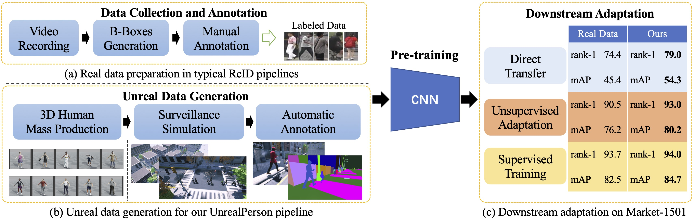

# UnrealPerson: An Adaptive Pipeline for Costless Person Re-identification
In our paper ([arxiv](https://arxiv.org/abs/2012.04268v2)), we propose a novel pipeline, UnrealPerson, that decreases the costs in both the training and deployment stages of person ReID. 
We develop an automatic data synthesis toolkit and use synthesized data in mutiple ReID tasks, including (i) Direct transfer, (ii) Unsupervised domain adaptation, and (iii) Supervised fine-tuning. 
 
The repo contains the **synthesized** **data** we use in the paper and presents examples of how to use synthesized data in various down-stream tasks to boost the ReID performance.

The codes are based on [CBN](https://github.com/automan000/Camera-based-Person-ReID) (ECCV 2020) and [JVTC](https://github.com/ljn114514/JVTC) (ECCV 2020).


**Highlights:**
1. In direct transfer evaluation, we achieve 38.5% rank-1 accuracy on MSMT17 and 79.0% on Market-1501 using our unreal data. 
2. In unsupervised domain adaptation, we achieve 68.2% rank-1 accuracy on MSMT17 and 93.0% on Market-1501 using our unreal data. 
3. We obtain a better pre-trained ReID model with our unreal data.  

## Demonstration



## Data Details

Our synthesized data (named Unreal in the paper) is generated with Makehuman, Mixamo, and UnrealEngine 4. We provide 1.2M images of 6.8K identities, captured from 4 unreal environments. 

Beihang Netdisk: [Download Link](https://bhpan.buaa.edu.cn:443/link/BD6502DF5A2A2434BC5FC62793F80F96) valid until: 2024-01-01

BaiduPan: [Download Link](https://pan.baidu.com/s/1P_UKdhmuDvJNQHuO81ifww) password: abcd

The image path is formulated as: unreal_v{X}.{Y}/images/{P}\_c{D}_{F}.jpg,
 for example, unreal_v3.1/images/333_c001_78.jpg.
 
_X_ represents the ID of unreal environment; _Y_ is the version of human models; _P_ is the person identity label; _D_ is the camera label; _F_ is the frame number. 

We provide three types of human models: version 1 is the basic type; version 2 contains accessories, like handbags, hats and backpacks; version 3 contains hard samples with similar global appearance. 
Four virtual environments are used in our synthesized data: the first three are city environments and the last one is a supermarket.
Note that cameras under different virtual environments may have the same label and persons of different versions may also have the same identity label. 
Therefore, images with the same (Y, P) belong to the same virtual person; images with the same (X, D) belong to the same camera. 
 
The data synthesis toolkit, including Makehuman plugin, several UE4 blueprints and data annotation scripts, will be published soon. 
 
## UnrealPerson Pipeline

### Direct Transfer and Supervised Fine-tuning

We use Camera-based Batch Normalization baseline for direct transfer and supervised fine-tuning experiments.
  
**1. Clone this repo and change directory to CBN**
```bash
git clone https://github.com/FlyHighest/UnrealPerson.git
cd UnrealPerson/CBN
```

**2. Download Market-1501, DukeMTMC-reID, MSMT17, UnrealPerson data and organize them as follows:**
<pre>
.
+-- data
|   +-- market
|       +-- bounding_box_train
|       +-- query
|       +-- bounding_box_test
|   +-- duke
|       +-- bounding_box_train
|       +-- query
|       +-- bounding_box_test
|   +-- msmt17
|       +-- train
|       +-- test
|       +-- list_train.txt
|       +-- list_val.txt
|       +-- list_query.txt
|       +-- list_gallery.txt
|   +-- unreal_vX.Y
|       +-- images
+ -- other files in this repo
</pre>


**3. Install the required packages**
```console
pip install -r requirements.txt
```


**4. Put the official PyTorch [ResNet-50](https://download.pytorch.org/models/resnet50-19c8e357.pth) pretrained model to your home folder: 
'~/.torch/models/'**


**5. Train a ReID model with our synthesized data**

Reproduce the results in our paper:

```console
CUDA_DEVICE_ORDER=PCI_BUS_ID CUDA_VISIBLE_DEVICES=0,1 \
python train_model.py train --trainset_name unreal --datasets='unreal_v1.1,unreal_v2.1,unreal_v3.1,unreal_v4.1,unreal_v1.2,unreal_v2.2,unreal_v3.2,unreal_v4.2,unreal_v1.3,unreal_v2.3,unreal_v3.3,unreal_v4.3' --save_dir='unreal_4678_v1v2v3_cambal_3000' --save_step 15  --num_pids 3000 --cam_bal True --img_per_person 40
```

We also provide the trained weights of this experiment in the data download links above.

Configs:
When ``trainset_name`` is unreal, ``datasets`` contains the directories of unreal data that will be used. ``num_pids`` is the number of humans and ``cam_bal`` denotes the camera balanced sampling strategy is adopted. ``img_per_person`` controls the size of the training set.

More configurations are in [config.py](https://github.com/FlyHighest/UnrealPerson/CBN/config.py).

**6.1 Direct transfer to real datasets**
```console
CUDA_DEVICE_ORDER=PCI_BUS_ID CUDA_VISIBLE_DEVICES=0 \
python test_model.py test --testset_name market --save_dir='unreal_4678_v1v2v3_cambal_3000'
```

**6.2 Fine-tuning**
```console
CUDA_DEVICE_ORDER=PCI_BUS_ID CUDA_VISIBLE_DEVICES=1,0 \
python train_model.py train --trainset_name market --save_dir='market_unrealpretrain_demo' --max_epoch 60 --decay_epoch 40 --model_path pytorch-ckpt/current/unreal_4678_v1v2v3_cambal_3000/model_best.pth.tar


CUDA_DEVICE_ORDER=PCI_BUS_ID CUDA_VISIBLE_DEVICES=0 \
python test_model.py test --testset_name market --save_dir='market_unrealpretrain_demo'
```


### Unsupervised Domain Adaptation

We use joint visual and temporal consistency (JVTC) framework. CBN is also implemented in JVTC.

**1. Clone this repo and change directory to JVTC**

```bash
git clone https://github.com/FlyHighest/UnrealPerson.git
cd UnrealPerson/JVTC
```

**2. Prepare data**

Basicly, it is the same as CBN, except for an extra directory ``bounding_box_train_camstyle_merge``, which can be downloaded from [ECN](https://github.com/zhunzhong07/ECN). We suggest using ``ln -s`` to save disk space. 
<pre>
.
+-- data
|   +-- market
|       +-- bounding_box_train
|       +-- query
|       +-- bounding_box_test
|       +-- bounding_box_train_camstyle_merge
+ -- other files in this repo
</pre>

**3. Install the required packages**

```console
pip install -r ../CBN/requirements.txt
```


**4. Put the official PyTorch [ResNet-50](https://download.pytorch.org/models/resnet50-19c8e357.pth) pretrained model to your home folder: 
'~/.torch/models/'**

**5. Train and test**

(Unreal to MSMT)

```console
python train_cbn.py --gpu_ids 0,1,2 --src unreal --tar msmt --num_cam 6 --name unreal2msmt --max_ep 60

python test_cbn.py --gpu_ids 1 --weights snapshot/unreal2msmt/resnet50_unreal2market_epoch60_cbn.pth --name 'unreal2msmt' --tar market --num_cam 6 --joint True 
```

The unreal data used in JVTC is defined in list_unreal/list_unreal_train.txt. The CBN codes support generating this file (see CBN/io_stream/datasets/unreal.py). 

More details can be seen in [JVTC](https://github.com/ljn114514/JVTC).

### References

- [1] Rethinking the Distribution Gap of Person Re-identification with Camera-Based Batch Normalization. ECCV 2020.

- [2] Joint Visual and Temporal Consistency for Unsupervised Domain Adaptive Person Re-Identification. ECCV 2020.


## Cite our paper

If you find our work useful in your research, please kindly cite:

```
@misc{zhang2020unrealperson,
      title={UnrealPerson: An Adaptive Pipeline towards Costless Person Re-identification}, 
      author={Tianyu Zhang and Lingxi Xie and Longhui Wei and Zijie Zhuang and Yongfei Zhang and Bo Li and Qi Tian},
      year={2020},
      eprint={2012.04268},
      archivePrefix={arXiv},
      primaryClass={cs.CV}
}
```

If you have any questions about the data or paper, please leave an issue or contact me: 
zhangtianyu@buaa.edu.cn
