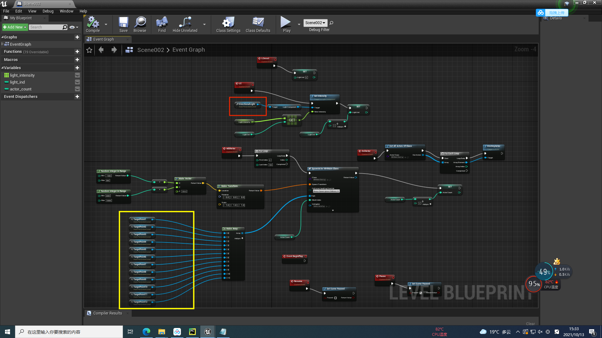

# Data Synthesis Toolkit

The data synthesis toolkit includs three parts: Makehuman plugin, several UE4 blueprints and data annotation scripts.
In this tutorial, we show how to generate more data that meets your own needs with our toolkit. 

## Overall Steps
There are some steps you must do:
1. Download our prepared UE4 content package. It includes texture materials, anim blueprint,  character blueprint, 3D human models and an example level. [BaiduNetdisk link](https://pan.baidu.com/s/1HuH0Ed4jSNEy6J2eLGwJAA) (verification code: **jvnh**)

2. Prepare UE4 and UnrealCV plugin. A compiled UnrealCV plugin for win64 UE4.24 has been included in the above link. 

3. Get familar with the scripts and have fun synthesizing data with UE4. 

## 1. (Optional) Prepare 3D Human Models 

**This step is optional if our prepared human models are sufficient for your demand.** We put 2800 models in the UE4 format content package. 

Steps to generate your own customized models: 

(1) Download or clone [makehuman v1.2](https://github.com/makehumancommunity/makehuman/releases/tag/v1.2.0). 

(2) Put the directory "9_massproduce" under the directory of makehuman/plugins. The massproduce is a [community plugin](https://github.com/makehumancommunity/community-plugins-massproduce) of Makehuman, used to generate random 3D human models by batch. We modify it to support more configs about clothing types. 

(3) Put clothing assets under the directory of makehuman data dir: `PathToUserDocumentDir/makehuman(win/linux) or MakeHuman(macOS)/v1py3/data/clothes`. You can download the assets using the script `script_makehuman_asset_download.py` and annotate the asset folder like this:
```
[GenderSymbol]_[ClothingType]_[The original asset folder name]
```
`GenderSymbol` can be `m`,`f`,or `mf`, indicating this asset is suitable for male only, female only or both male & female. 
`ClothingType` can be one of `up`,`low`,`full`,`fullo`,`shoe`,`mask`,`scarf`,`glasses`,`handheld`,`headwear`,`backpack`,`blank`. Specially, you need to prepare several assets that are invisible when applied on 3D models. They are used to occupy the material slots. The aligned material slots make it easy for us to change materials later in UE4.   


(4) After all three steps above, you can now (a) restart your makehuman program, (b) go to tab "Geometries->Eyes" and select "Low-poly" (otherwise it looks weird in UE4), (c) go to tab "Pose/Animate->Skeleton" and select "Game engine", (d) go to tab "Community->Mass produce", in "Export settings" choose file format "FBX", in the middle panel and the left panel choose your preferred configurations, click "Produce" after entering the number of models you want. 

(5) Import the generated fbx files to UE4. You may find these functions useful: [other_scripts](UnrealPerson-DataSynthesisToolkit/other_scripts.py). And more adjustments to animations and skeletons may be necessary. You may refer to the Blueprint class `MHMainClass`.   

## 2. Prepare UE4 and UnrealCV plugin. 

(1) Install [UnrealEngine 4](https://www.unrealengine.com/en-US/). The version number is 4.24.3. 

(2) Install and enable UnrealCV in UE4. [UnrealCV](https://github.com/unrealcv/unrealcv) is an excellent tool for computer vision researchers. We fix some small issues when compiling this plugin for UE 4.24.3. To use this plugin in 4.24.3, you can use the unrealcv in this repo. Note that we have not fully tested our modifications. We only ensure that the functions we use for UnrealPerson data synthesis are okay. Please refer to this [page](http://docs.unrealcv.org/en/master/plugin/install.html#compile-plugin) when compiling unrealcv. To connect UE4 with python code, you also need to install unrealcv pypi package.

(3) After compiling unrealcv, you need to enable it for your unreal engine projects. Go to "Settings->Plugins", and search "unrealcv", check the "enable" box. Besides unrealcv, there are several plugins you need: **EasyJsonParser, RealTimeImport, RecompileAll**. You may purchase them in the online UE marketplace. In addition, some built-in plugins need to be enabled, including Sequencer Scripting and Python Editor Script Plugin.


## 3. (Optional) Prepare other assets: animations, textures, virtual scenes, etc.

**This step is optional. Clothing textures and animation assets are included in the content package.** 

(1) To enrich the appearance of virtual humans, we replace clothing textures with real clothing images from DeepFashion and Clothing-co-parsing. You can apply these two datasets and cut the patches using the provided scripts in this repo: [script1](UnrealPerson-DataSynthesisToolkit/script_clothingcoparsing_clothing_patch.py), [script2](UnrealPerson-DataSynthesisToolkit/script_deepfashion_clothing_patch.py).

(2) We use Mixamo to animate the generated 3D models. You may obtain more animations from this [website](https://www.mixamo.com/). 

(3) Prepare some virtual scenes. You may download free assets from the Internet, or purchase some virtual environments in UE marketplace. In UnrealPerson, we use Urban City, Modern City Downtown, Supermarket and Modular Buildings. They are available in the [marketplace](https://www.unrealengine.com/marketplace/en-US/store).

## 4. Introduction to Blueprints
In this section, we introduce how the character and level work together to mimic the virtual surveillance. After configuring the charactor BP and editing the level map, we can run the game and collect images. 

(1) Character BP: MHModel/MHModelDivide

We provide several blueprints in UE4 contents folder (Contents/MHModel). Here, we mainly introduce MHMainClass. The others share similar structures. 

(Note that it takes much time compiling shaders openning at the first time. )

The character blueprint MHMainClass has some important variables. 

`path` is an array of TargetPoint. The virtual human will follow the path defined by `path` array. The movement method is `AI MoveTo`. If stuck, they will teleport to the destination target point. 

`counter` controls which target point the virtual human should go to. 

`mesh_index` controls the 3D model. 3D human models are stored in `mesh_list`, which is an array of SkeletalMesh. 

`xx_texture` arrays store the image file paths of textures. You may read the construction script of MHMainClass to know how to randomly apply textures on various body parts. To change these texture arrays, I recommond using `set_xx_texture_list()` functions in other_scripts.py.

You can edit `mesh_list` and texture arrays to create your own version of virtual humans.  

(2) Level 

In the level scene, there are two things to do: 

a. Add navigation and target points. 

Put a NavMeshBoundsVolume in the scene and adjust the size. 
Put several target points in the scene.
Then build paths so that AIMoveTo can work well in this level. 

b. Edit level blueprint.

First copy all texts in levelbp.txt and paste into the level blurprint:



You need to add `light_intensity` array, `light_ind` (default 0), and `actor_count` (default 0) and then reconnect error nodes. 
Next, pull the sky light in the level scene to the red box area. You can set different intensity values in the `light_intensity` array and trigger LC event to change the scene light. 

Next, pull the target points to the yellow area, then recompile the level blueprint.

In AddActor event, you can change the virtual human BP. The ForLoop in AddActor event controls how many virtual humans appear. 

AddActor and DelActor will be called several times when collecting data. 

(3) Run the game and collect camera information.

Run the game in UE4 first and then run the script caminfo_collect.py in UnrealPerson-DataSynthesisToolkit. When you enable all the plugins, your python script can communicate with UE4 now. 

Then, you can execute `ce AddActor` in UE4 console to generate some actors and help you locate the virtual cameras.

Adjust the view and call `gc()` in the python console to record current camera location and rotation. If you call `gc()` for 6 times, it means person images will be captured from these 6 positions. Use `sa()` to save the camera location and rotation information in a plk file.

Stop the game after saving the camera information. 

(4) Re-run the Game and collection images.
Run the game again and run the python script generate_datasets.py. Of course, you need to rewrite the parameters in generate_datasets.py. The file provided in this repo is only an example to show how to communicate with UE4 with python. 

## 5. Post process

(1) Cut to images

We prepare a python script postprocess.py. It includes all functions you need to cut person images and form a person re-id dataset. 

(2) Video-based ReID: combine to tracklets

You may refer to postprocess_video.py and interplate_video.py to generate tracklets. 

## Cite our paper

If you find our work useful in your research, please kindly cite:

```
@inproceedings{unrealperson,
      title={UnrealPerson: An Adaptive Pipeline towards Costless Person Re-identification}, 
      author={Tianyu Zhang and Lingxi Xie and Longhui Wei and Zijie Zhuang and Yongfei Zhang and Bo Li and Qi Tian},
      year={2021},
      booktitle={CVPR}
}
```

If you have any questions about the data or paper, please leave an issue or contact me:
zhangtianyu@buaa.edu.cn